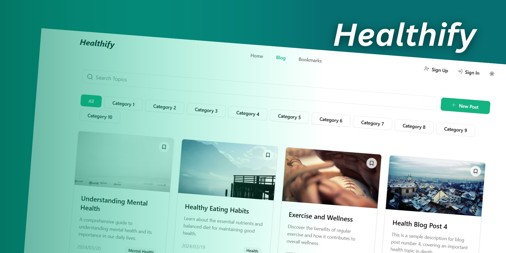

# Health Blogging Platform



A modern, health-focused blogging platform built with React, TypeScript, and Vite. Designed for sharing, discovering, and bookmarking health-related articles with a beautiful, responsive UI.

---

## 🚀 Features

- 📝 Create, view, and bookmark health blog posts
- 🔍 Powerful search and category filtering
- 🏷️ Tag and categorize posts
- 📚 Responsive card-based layouts for posts
- 🌙 Light & dark mode support
- 🔒 Authentication (Sign up, Login, Password reset)
- ⚡ Fast, modern UI with Tailwind CSS
- 🗂️ Organized codebase with reusable components

---

## 🛠️ Tech Stack

- **React** 19 + **TypeScript**
- **Vite** for fast development
- **Tailwind CSS** for styling ([see index.css](src/index.css))
- **React Router** for navigation
- **@tanstack/react-query** for data fetching
- **Lucide React** for icons
- **Zod** for validation
- **Sonner** for notifications

See [package.json](package.json) for all dependencies.

---

## 📂 Project Structure

- `src/components/` – UI components (cards, navbar, forms, etc.)
- `src/pages/` – Main pages (Home, Blog, Bookmark, Auth, etc.)
- `src/hooks/` – Custom React hooks
- `src/types/` – TypeScript types
- `src/validations/` – Zod validation schemas
- `src/index.css` – Tailwind CSS and custom styles

---

## 🖥️ Setup & Development

1. **Install dependencies:**
   ```bash
   npm install
   ```
2. **Start the dev server:**
   ```bash
   npm run dev
   ```
3. **Open in browser:**
   Visit [http://localhost:5173](http://localhost:5173)
---

## 📄 License

MIT
